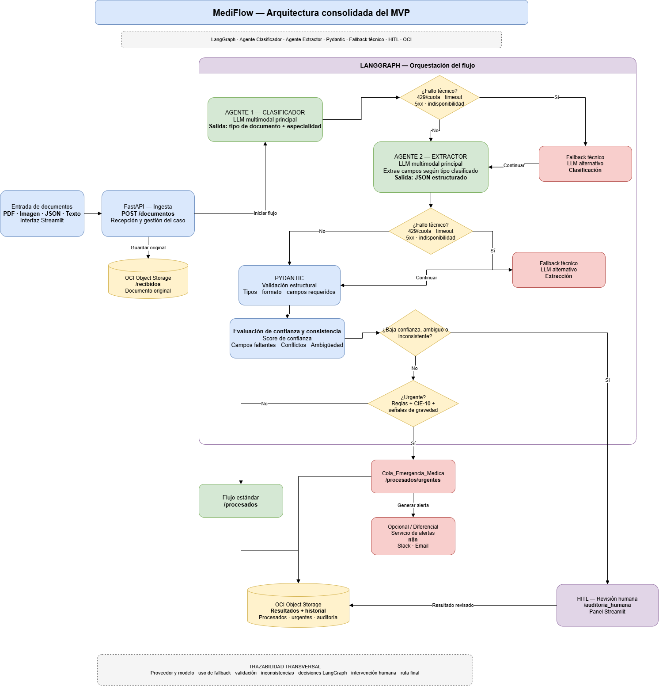

# MediFlow

Sistema inteligente para procesamiento y triaje de documentos clínicos.

Proyecto desarrollado para Hackathon ONE G10.

## Descripción general del proyecto

MediFlow es un agente autónomo para el triaje, extracción y enrutamiento de documentos clínicos. El sistema recibe documentos clínicos y administrativos en distintos formatos (PDF, imagen o texto), los clasifica automáticamente, extrae los datos esenciales con un LLM multimodal, y los enruta al destino correcto según su nivel de urgencia y confianza de extracción — sin intervención humana manual para los casos estándar.

Proyecto desarrollado para el Hackathon ONE G10 (Oracle Next Education & Alura).

## Objetivo del proyecto

Reducir el tiempo y los errores del procesamiento manual de documentos clínicos en hospitales, laboratorios y aseguradoras de salud, mediante un pipeline automatizado de clasificación, extracción y enrutamiento, con revisión humana (Human-in-the-Loop) para los casos ambiguos, inconsistentes o de baja confianza.

## Arquitectura aprobada

La arquitectura está orquestada con LangGraph y combina dos agentes especializados, validación estructural y lógica de decisión condicional:

- **Agente Clasificador:** identifica el tipo de documento y la especialidad clínica correspondiente.
- **Agente Extractor:** extrae los datos clínicos estructurados según el tipo de documento clasificado.
- **Validación (Pydantic):** valida tipos, formato y campos requeridos del JSON extraído.
- **Evaluación de confianza:** calcula un score de confianza y detecta ambigüedad, inconsistencias o campos faltantes.
- **Enrutamiento condicional:** deriva el documento a flujo estándar, cola de emergencia médica, o revisión humana (HITL), según urgencia y nivel de confianza.
- **Fallback técnico:** ante fallos de la API del LLM (timeout, error 5xx, indisponibilidad), el sistema reintenta con un LLM alternativo antes de fallar.
- **Persistencia:** los documentos originales y los resultados se almacenan en OCI Object Storage, organizados por estado (recibidos/, procesados/, auditoria_humana/).

### Diagrama de arquitectura



## Tecnologías definidas

- Python 3.11
- FastAPI — ingesta y API REST
- LangGraph — orquestación del flujo del agente
- Pydantic — validación estructural de datos
- Google Gemini — modelo LLM multimodal (clasificación y extracción)
- OCI Object Storage — almacenamiento de documentos y resultados
- Streamlit — interfaz de triaje

## Estructura del repositorio

```
G10-LATAM-EQUIPO-31/
├── app/
│   ├── agents/       # Agentes de clasificación y extracción
│   ├── api/           # Endpoints FastAPI (ingesta de documentos)
│   ├── graph/          # Orquestación del flujo con LangGraph
│   ├── schemas/        # Modelos Pydantic (validación de datos)
│   ├── services/        # Servicios externos (OCI, LLM, etc.)
│   └── config/           # Configuración del proyecto
├── tests/                 # Pruebas automatizadas
├── samples/                # Casos de prueba / documentos de ejemplo
├── docs/                     # Documentación y diagramas
├── requirements.txt            # Dependencias del proyecto
├── .env.example                 # Variables de entorno de referencia
├── main.py                       # Punto de entrada de la aplicación
└── README.md
```

`app/services/oci_storage_service.py` — servicio de conexión con OCI Object Storage (carga y recuperación de documentos), implementado y probado en MF-04.

## Configuración inicial del entorno

1. Verificar que tenés Python 3.11 instalado.
2. Crear y activar un entorno virtual:
   ```
   python -m venv .venv
   .venv\Scripts\activate      # Windows
   source .venv/bin/activate   # macOS/Linux
   ```
3. Instalar las dependencias:
   ```
   pip install -r requirements.txt
   ```
4. Copiar .env.example como .env y completar los valores reales (API keys de Gemini, credenciales de OCI):
   ```
   cp .env.example .env
   ```

## Flujo de trabajo con Git

- **main** — rama estable. Solo recibe código ya integrado y probado.
- **develop** — rama de integración. Base para todas las actividades del equipo.
- **feature/*** — una rama por actividad, creada desde develop (ej: feature/MF-01-estructura-base).
- Al finalizar una actividad, se abre un Pull Request hacia develop para su revisión e integración.
- Cuando develop tenga una versión estable, se integra a main.

## Equipo

| Actividad | Responsable |
|---|---|
| MF-01 Estructura base del proyecto | Katherine / apoyo coordinación |
| MF-02 Contratos y schemas Pydantic | Manuel / Kimberlyn |
| MF-03 Ingesta mediante FastAPI | Duvan / Kimberlyn |
| MF-04 Integración inicial OCI Object Storage | Katherine |
| MF-05 Agente Clasificador | Zahir |
| MF-06 Agente Extractor | Mauricio |
| MF-07 Orquestación base LangGraph | Jennifer + Kimberlyn |
| MF-08 Integración del flujo completo | Kimberlyn |
| MF-16 Dataset/casos de prueba | Manuel / Kimberlyn |

## Cierre del Sprint 1

Al cierre del Sprint 1 quedó integrado y validado el flujo completo de procesamiento de documentos clínicos:

**Ingesta → Clasificador → Extractor → Validación → OCI**

El sistema recibe el documento a través del endpoint `POST /documentos`, lo clasifica, extrae los datos clínicos estructurados con el LLM multimodal y valida la respuesta contra los contratos Pydantic. El documento original se persiste en OCI Object Storage, en la carpeta `recibidos/`.

- **Formatos probados:** TXT, PDF, PNG y JPG, incluyendo casos multimodales de imagen.
- **Pruebas automatizadas:** 24/24 aprobadas sobre la rama `develop`.
- **Evidencias:** el detalle de cada ejecución y las respuestas generadas se documentan en [docs/evidencias-sprint-1.md](docs/evidencias-sprint-1.md).
