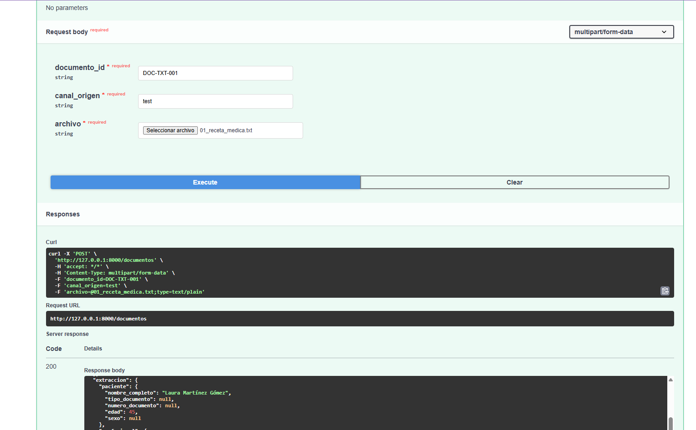
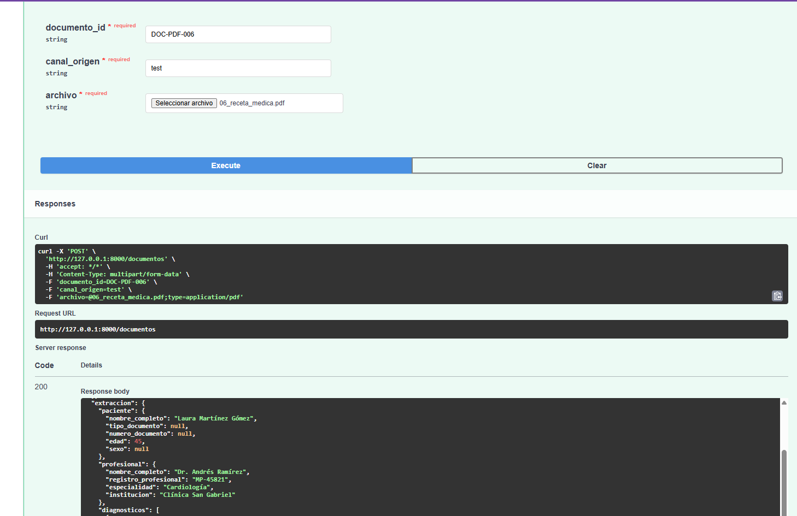
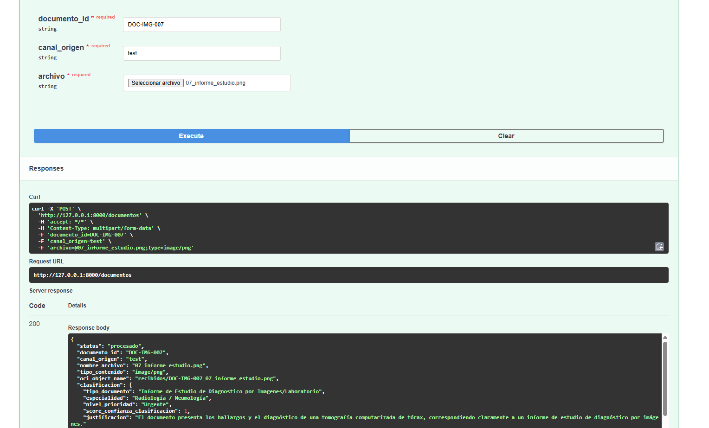
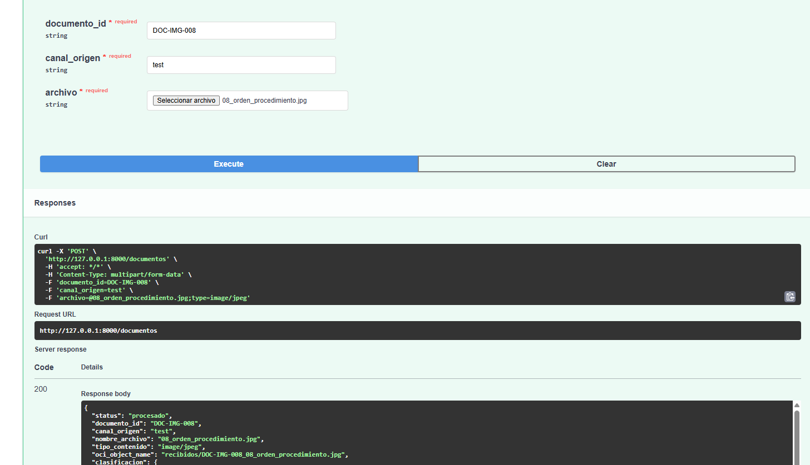
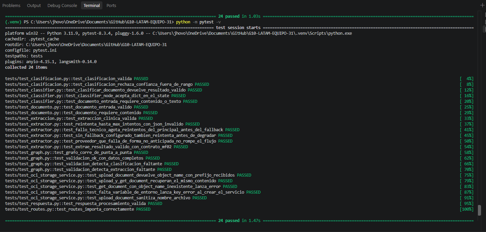

# Evidencias de validación — Sprint 1

Este documento reúne las evidencias de las pruebas realizadas sobre el flujo integrado de MediFlow al cierre del Sprint 1.

Se validó el procesamiento de documentos clínicos en diferentes formatos mediante el endpoint `POST /documentos`, verificando el flujo de ingesta, almacenamiento del documento original, clasificación, extracción de información clínica y validación de la respuesta estructurada.

## Prueba con documento TXT

**Documento:** `01_receta_medica.txt`  
**ID:** `DOC-TXT-001`

Se validó el procesamiento de una receta médica en formato TXT.

[Ver respuesta JSON](assets/sprint-1/respuesta-flujo-txt.json)

---

## Prueba con documento PDF

**Documento:** `06_receta_medica.pdf`  
**ID:** `DOC-PDF-006`

Se validó el procesamiento de una receta médica en formato PDF.

[Ver respuesta JSON](assets/sprint-1/respuesta-flujo-pdf.json)

---

## Prueba con documento PNG

**Documento:** `07_informe_estudio.png`  
**ID:** `DOC-IMG-007`

Se validó el procesamiento multimodal de un informe de estudio en formato PNG, clasificado con nivel de prioridad urgente.

[Ver respuesta JSON](assets/sprint-1/respuesta-flujo-png.json)

---

## Prueba con documento JPG

**Documento:** `08_orden_procedimiento.jpg`  
**ID:** `DOC-IMG-008`

Se validó el procesamiento multimodal de una orden de procedimiento en formato JPG.

[Ver respuesta JSON](assets/sprint-1/respuesta-flujo-jpg.json)

---

## Pruebas automatizadas

Después de integrar los componentes del Sprint 1 se ejecutó la suite completa de pruebas automatizadas sobre la rama `develop`.

**Resultado: 24 de 24 pruebas aprobadas.**

---

## Resultado de la validación

Las pruebas realizadas permitieron validar el flujo integrado del Sprint 1 con documentos TXT, PDF, PNG y JPG, incluyendo el procesamiento de archivos de texto y documentos multimodales.

Las respuestas estructuradas generadas durante cada ejecución se conservan en esta carpeta como evidencia de los resultados obtenidos.