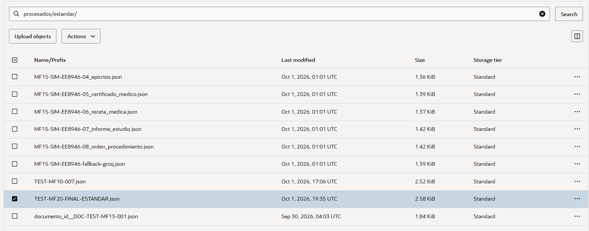
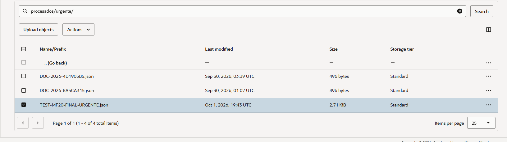
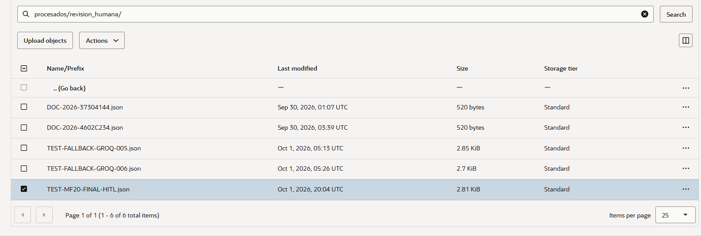
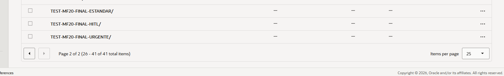
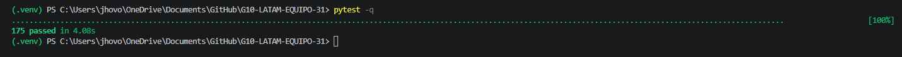

# Evidencias de validación — Sprint 2

Este documento reúne las evidencias de las pruebas realizadas sobre el flujo
integrado de MediFlow al cierre del Sprint 2.

Se validó el flujo completo de procesamiento incorporando validación de
consistencia, evaluación de confianza, routing, persistencia de resultados
en OCI Object Storage, trazabilidad y fallback técnico.

## Escenario estándar

**Documento:** `01_receta_medica.txt`  
**ID:** `TEST-MF20-FINAL-ESTANDAR`

Se validó el procesamiento de una receta médica con prioridad de rutina.

El flujo finalizó correctamente con destino:

`estandar`

Se verificó directamente en OCI Object Storage la persistencia del resultado
en:

`procesados/estandar/TEST-MF20-FINAL-ESTANDAR.json`

[Ver respuesta JSON](assets/sprint-2/respuesta-estandar.json)

---

## Escenario urgente

**Documento:** `02_informe_estudio.txt`  
**ID:** `TEST-MF20-FINAL-URGENTE`

Se validó el procesamiento de un informe de estudio con prioridad urgente.

El flujo identificó la condición de urgencia y finalizó correctamente con
destino:

`urgente`

Se verificó directamente en OCI Object Storage la persistencia del resultado
en:

`procesados/urgente/TEST-MF20-FINAL-URGENTE.json`

[Ver respuesta JSON](assets/sprint-2/respuesta-urgente.json)

---

## Escenario de revisión humana (HITL)

**Documento:** `09_receta_inconsistente_hitl.txt`  
**ID:** `TEST-MF20-FINAL-HITL`

Se utilizó un caso controlado creado específicamente para validar el routing
hacia revisión humana.

El documento se presenta como una receta médica pero contiene además un
estudio solicitado, activando una regla de inconsistencia de MF-09.

La inconsistencia afecta la evaluación de confianza y el flujo finalizó
correctamente con destino:

`revision_humana`

Se verificó directamente en OCI Object Storage la persistencia del resultado
en:

`procesados/revision_humana/TEST-MF20-FINAL-HITL.json`

[Ver respuesta JSON](assets/sprint-2/respuesta-hitl.json)

---

## Historial y trazabilidad

Se verificó directamente en OCI Object Storage la creación del historial
correspondiente a los tres escenarios ejecutados:

- `TEST-MF20-FINAL-ESTANDAR/`
- `TEST-MF20-FINAL-URGENTE/`
- `TEST-MF20-FINAL-HITL/`

---

## Pruebas automatizadas

Después de integrar los componentes del Sprint 2 se ejecutó la suite completa
de pruebas automatizadas.

**Resultado: 175 pruebas aprobadas.**

---

## Resultado de la validación

Las pruebas realizadas permitieron validar los tres destinos definidos para
el flujo integrado del Sprint 2:

- `estandar`
- `urgente`
- `revision_humana`

También se verificó la persistencia de los resultados y la creación del
historial correspondiente en OCI Object Storage.

Las respuestas JSON generadas durante las ejecuciones E2E se conservan en
`docs/assets/sprint-2/` como evidencia de los resultados obtenidos.